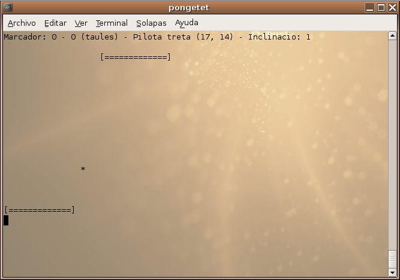

Some C games 
============= 
by Joan Alba Maldonado (joanalbamaldonadoNO_SPAM_PLEASE AT gmail DOT com, without NO_SPAM_PLEASE)

Some simple games written in C language.

Version: different versions 
- Date: 2006 to 2007.

## Description

Some games I made during the time I was studying the "Programació estructurada i modular / Programación estructurada y modular" (Structured and modular programming) subject that belonged to "CFGS DAI (Ciclo Formativo de Grado Superior en Desarrollo de Aplicaciones Informáticas)" which is a Software development associate degree equivalent (similar to Foundation degree in the UK, Diploma of Higher Education in Scotland or Higher Certificate in the Republic of Ireland) at IES Baix Camp school in Reus city (Spain).

All are text-based games. It includes a blackjack (aka twenty-one) card game, a roulette game (with four different ways to play), a John Conway's Game of Life (cells can be inserted either manually or randomly), a Mastermind game, Buscacaminas (pathfinding program with some Minesweeper characteristics), Pongetet (a pong game) and Pilotes (just a bouncing text generator). The IDE used was Bloodshed Dev-C++.

## License

This project can be used, reproduced, distributed and modified freely for any non-commercial purposes but always keeping the author's name and copyright clauses. Other than that, just use this project as you wish but never sell it!